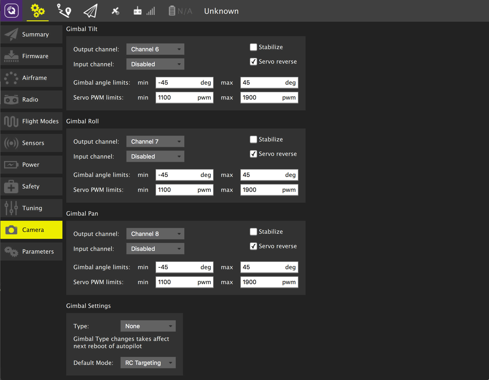
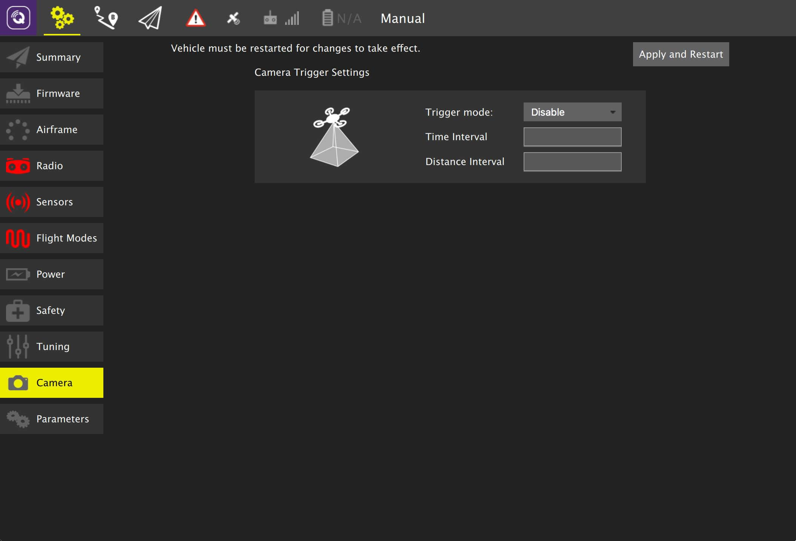

# Introduction
Thank you for applying to the lead embedded engineer role at Aerora.

If you're in this repo, you should have already completed the initial screening interview and been contacted by the hiring manager to schedule the US technical interview.

The interview process for this role is a follows:
1. Screening (completed)
2. US technical interview (current phase)
3. Global technical interview
4. Management/leadership interview

Please look at the interview guide, especially section 2, to determine when to schedule your interview so you give yourself time to complete the practical exercise.

For 2.3, we'd like candidates to limit the time they spend on the practical exercise to between 2 to 4 hours. If you find that you need to spend more than that, please reach out. We know job interviewing is busy and want to make the amount of time spend reasonable.

We will be conducting the interview via MS Teams and recording the interview so that our global interview team can review the interview in their timezone and prepare follow on questions for the global interview.

This interview is a work in progress, so if you have any recommendations or feedback, please let us know via LinkedIn.

## Instructions
1. Fork this repo to a private repo of your own and add [GhelAerora](https://github.com/GhelAerora)
2. Fill out Section 1 and 2 and commit to your repo by 11am US Pacific Time the morning of the interview

# Section 1. Background
*Fill out the table below noting your experience in the area. Then, distribute 1.0 point across the rank column using whole tens. Finally, order the table from highest to lowest.*

## 1.1. Your background
| Skill | Expert | Good | Limited | None | Rank |
|-------|--------|------|---------|------|------|
| Embedded system hardware kit based prototyping      | :heavy_check_mark:  |   |   |   | 0.09 |
| Drone autopilot integration on ArduPilot/PX4        | :heavy_check_mark: |   |   |   | 0.09 |
| Embedded firmware and configuration management      | :heavy_check_mark:   |   |   |   | 0.09 |
| Image signal processing                             | :heavy_check_mark:  |   |   |   | 0.09 |
| IP camera encoding/decoding and interfaces          | :heavy_check_mark:  |   |   |   | 0.09 |
| AI on embedded devices & embedded NPUs              | :heavy_check_mark:  |   |   |   | 0.09 |
| Embedded software development                       |   | :heavy_check_mark:  |   |   | 0.06 |
| Drone software development                          |   | :heavy_check_mark:  |   |   | 0.06 |
| C/C++ coding proficiency                            |   | :heavy_check_mark:  |   |   | 0.06 |
| Linux application development internals             |   | :heavy_check_mark:  |   |   | 0.06 |
| QGroundControl modification & enhancement           |   | :heavy_check_mark:  |   |   | 0.06 |
| Remote development over VPN, SSH, remote server IDE |   | :heavy_check_mark:  |   |   | 0.06 |
| Embedded system security                            |   |   | :heavy_check_mark:  |   | 0.03 |


**For example:**
```
| Skill   | Expert | Good | Limited | None | Rank |
|---------|--------|------|---------|------|------|
| Skill B |   X    |      |         |      | 0.5  |
| Skill A |        |  X   |         |      | 0.3  |
| Skill E |        |      |    X    |      | 0.1  |
| Skill D |        |      |    X    |      | 0.1  |
| Skill C |        |      |         |  X   | 0.0  |
```

## 1.2. Most Qualifying Background
**What technical experience most qualifies you for this position? Please describe the associated technical aspects.**

I bring an in-depth technical knowledge of robotics development. My experience extends beyond lab research and development to real world deployments and trials. I have helped companies in the past to better align their technology roadmap with the product roadmap that aligns with the needs of the customers as well as emerging technological advancements. Of course, I ticked all the boxes in the table above expressing my variety of experience and exposure to robotic software development.

## 1.3. Skill Gap Plan
**Based on the job description and what you understand the role to be, what is the most significant technical skill you are missing and how will you go about learning that skill?**

Challenge:
I realize that I may need to acquire new skills, primarily in embedded system security. In the past, I have developed secure dual boot firmware architectures for over the air programm (OTP). I have used data encryption and checksum for data validation over wireless mesh network for RADAR sensors. 

Opportunity:
I will first try to understand the scope of embedded system security requirement within the company and work towards acquiring those skills through self-study and experimentation. If required, I could take a few certifications for a proof of expertise in the domain.

## 1.4. Highlight
**Highlight a technical solution where you were the driving force and the technical details behind it.**

At one of my previous companies, I was asked to develop a situational awareness solution for a fleet of mining vehicles. I developed a proof-of-concept (POC) for the technology on a desktop application. The same technology was later developed for an STM32 based microcontroller. The solution used a suite of sensor data from a vehicle (such as GPS/GNNSS, Odometry, Gear Status, Braking Status, RADAR) along with vehicle-to-vehicle communication to develop an ego-centric representation of each vehicle along with adjacent vehicles in the vicinity.

From conceptualization, early design, prototyping and development; I ensured the product was customer ready and demo ready for workshop, conferences and tradeshows.

The whole end-to-end solution was a proprietary software developed within the company and used zero open-source software. This was quite an achievement for production software development in any robotic application.

# Section 2. Technical
## 2.1. What are two things that you would change about Linux or Android?

I wish the following for Linux:
#### 2.1.1 **User-Friendliness**: 
Linux is primarily used by software engineering people, and there's a desire to make it more user-friendly for a broader audience. It would be ideal if non-technical users were also equally able to use Linux without the complexities associated with downloading applications for basic daily usage. Despite the advancements with Chromebooks and MacBooks, which are primarily Linux-based, there's still a significant journey ahead to achieve this level of user-friendliness.

#### 2.1.2 **Hardware Driver Support**: 
Some hardware drivers are not well supported in Linux, requiring users to ensure that their machines have hardware compatible with standard Linux distributions such as Ubuntu or RHEL. This limitation can pose challenges in achieving a seamless out-of-the-box experience for various hardware configurations.

I wish the following for Android:

#### 2.1.3 **Programming Language Preference**: 
Android is primarily developed in Java, which can be a barrier for embedded developers accustomed to working with C/C++, or Python. This language choice can make it more challenging for those with a background in embedded systems or those who prefer these languages to dive into Android or mobile application development. 

#### 2.1.4 **Development Environment Complexity**: 
The complexity of the Android development environment, particularly in setting up and managing project dependencies with Gradle, can be a significant limitation. This complexity can slow down development processes, especially for those not specialized in Android development, to the extent that I personally had to request an additional resource (hiring an Android developer) to expedite the development within a robotics team.

These limitations suggest areas where Android could potentially improve to become more accessible and user-friendly for developers with different backgrounds and preferences, especially those in the embedded systems and robotics fields.

## 2.2. Describe your preferred task, test, project, and source control management workflows.

The project management tool depends on the scope of the project and size of the team.

In a research setting, a github and a regular team meeting with organized agenda and action items suffices.

In a product development environment, we need workflows to facilitate research, development and quality verifications. For these cases, a Jira (or Trello or some ticketing system) could be useful. Some teams use sprints (1-2 weeks dev cycle) to prioritize tasks and plan for resources within the team where as others focus on achieving milestones set on a longer time horizon. This depends on the nature of assignment, such as bug fixes versus developing a technical roadmap with experimentation and prototyping under uncertainities.

Documentations could be embedded in code in a research project whereas a dedicated Confluence/Wiki may be necessary in cross-disciplinary team where some members are not well-versed in reading through the code.

No matter the team, markdown documentation and latex notes are essential when working on a math heavy project.

While I have worked in Waterfall, Agile and somewhat Agile workflows before, my choice has always been around lowering the barrier for communication between team members, either with regular sync-ups (no meetings required) or with standup notes (again, no meetings required). 

## 2.3. Practical exercise
[QGroundControl](http://qgroundcontrol.com/) is an open source ground control station for drones ([Github](https://github.com/mavlink/qgroundcontrol)).

A client wants to save video from the sensor to the drone's SD card in the air and also wants to stream the video to the Internet AND save it to the the Android ground control station itself.

#### 2.3.1. Identify the relevant components in QGroundControl that are involved in this use case and provide a high level sketch for presentation to the engineering team. You can use whatever formal or informal diagramming method you prefer. Link to the related artifact in your repository within this markdown file.

This diagram shows the basic setup where a user connects QGC to a drone through a VPN network. The VPN ensures that the connection between QGC and the drone is secure and can traverse through the internet or restricted networks.

```
[ QGroundControl ]      <---- VPN Tunnel ---->      [ AWS/Azure VPN Server ]  <--LTE-->  [ Drone ]
       |                                                       |                            |
       |                                                       |                            |
[ User's Device ]                                   [ Network Infrastructure ]        [ GStreamer ]
       |                                                                                    |
       |------------------------------------------------------------------------------------|
                                GStreamer for Video Streaming
```

1. **User's Device**: This is where QGroundControl is installed. The device is connected to a VPN, creating a secure tunnel to the AWS/Azure VPN server.
2. **VPN Tunnel**: A secure connection established over the internet that encrypts data passing through it, ensuring privacy and security. For AWS, this could be set up using AWS Site-to-Site VPN. For Azure, Azure VPN Gateway can be used.
3. **AWS/Azure VPN Server**: Acts as a bridge between the user's device and the drone. It decrypts the data received from the user's device and forwards it to the drone. This server is part of the cloud provider's network services.
4. **Network Infrastructure**: Represents the network over which the VPN server communicates with the drone. This could be the internet or a private network.
5. **Drone**: The UAV (Unmanned Aerial Vehicle) that communicates with QGroundControl. It sends and receives commands and data.
6. **GStreamer**: Integrated with QGroundControl on the user's device for handling video streaming from the drone. The video stream is securely transmitted over the VPN tunnel.

This setup ensures secure communication between QGroundControl and the drone, leveraging cloud VPN services for enhanced security and reliability. GStreamer processes the video stream, providing high-quality video to the user.

A prototype of an OpenVPN server-client setup is given in [AWSVPNServer](AWSVPNServer/spawnAWS.py). The detail documentation for the server setup may be found in [AWSSetup.md](AWSSetup.md)

Since we are streaming through cloud, it is worthwhile to spawn an AWS S3 storage container to store the data being transmitted for posterity.
```
[ QGroundControl ]      <---- VPN Tunnel ---->      [ AWS/Azure VPN Server ]  <--LTE-->  [ Drone ]
       |                                                       |                            |
       |                                                       |                            |
[ User's Device ]                                   [ Network Infrastructure ]        [ GStreamer ]
       |                                                                                    |
       |------------------------------------------------------------------------------------|
                                GStreamer for Video Streaming
                                         |
                                         |
                                         v
                                    [ AWS S3 ]
                              (Data Storage Container)
```

#### 2.3.2. Is what the client asking possible with the existing code? Be prepared to talk us through how the features would work with the existing code or what changes would be needed.

The current documentation for camera setup is limited to specific gimbal camera setup.
https://docs.qgroundcontrol.com/master/en/qgc-user-guide/setup_view/camera.html


Also, link to the documentation PX4 camera setup is broken on the webpage
https://docs.px4.io/master/en/peripherals/camera.html

Even the documentation for 3DR Pixhawk is broken on this webpage
https://docs.px4.io/master/en/advanced_config/parameters.html#parameter-not-in-firmware 

Another broken link for gstreamer:
https://developer.gnome.org/gstreamer/stable/gst-running.html


If you dig further in the setup of QGC, you will find instructions for setting up `gstreamer`

```
sudo usermod -a -G dialout $USER
sudo apt-get remove modemmanager -y
sudo apt install gstreamer1.0-plugins-bad gstreamer1.0-libav gstreamer1.0-gl -y
sudo apt install libfuse2 -y
sudo apt install libxcb-xinerama0 libxkbcommon-x11-0 libxcb-cursor0 -y
```

The usage of a gstreamer pipeline in UDP could look like this

##### UDP Pipeline

For the time being, the RTP UDP pipeline is somewhat hardcoded, using h.264 or h.265. It's best to use a camera capable of hardware encoding either h.264 (such as the Logitech C920) or h.265. On the sender end, for RTP (UDP Streaming) you would run something like this:

h.264
```
gst-launch-1.0 uvch264src initial-bitrate=1000000 average-bitrate=1000000 iframe-period=1000 device=/dev/video0 name=src auto-start=true src.vidsrc ! video/x-h264,width=1920,height=1080,framerate=24/1 ! h264parse ! rtph264pay ! udpsink host=xxx.xxx.xxx.xxx port=5600
```

h.265
```
ffmpeg -f v4l2 -i /dev/video1 -pix_fmt yuv420p -c:v libx265 -preset ultrafast -x265-params crf=23 -strict experimental -f rtp udp://xxx.xxx.xxx.xxx:5600
```

Where xxx.xxx.xxx.xxx is the IP address where QGC is running.


To test using a test source on localhost, you can run this command:
```
gst-launch-1.0 videotestsrc pattern=ball ! video/x-raw,width=640,height=480 ! x264enc ! rtph264pay ! udpsink host=127.0.0.1 port=5600
```
Or this one:
```
gst-launch-1.0 videotestsrc ! video/x-raw,width=640,height=480 ! videoconvert ! x264enc ! rtph264pay ! udpsink host=127.0.0.1 port=5600
```

On the receiving end, if you want to test it from the command line, you can use something like:
```
gst-launch-1.0 udpsrc port=5600 caps='application/x-rtp, media=(string)video, clock-rate=(int)90000, encoding-name=(string)H264' ! rtpjitterbuffer ! rtph264depay ! h264parse ! avdec_h264 ! autovideosink fps-update-interval=1000 sync=false
```
Or this one:
```
gst-launch-1.0 udpsrc port=5600 ! application/x-rtp ! rtpjitterbuffer ! rtph264depay ! avdec_h264 ! videoconvert ! autovideosink
```
Or this one, note that removing rtpjitterbuffer would reduce video latency as low latency mode is doing:
```
gst-launch-1.0 udpsrc port=5600 caps='application/x-rtp, media=(string)video, clock-rate=(int)90000, encoding-name=(string)H264' ! rtpjitterbuffer ! parsebin ! decodebin ! autovideosink fps-update-interval=1000 sync=false
```

##### What seems to be missing?
There seems to be an adequate infrastructure for peer-to-peer (PTP) communication between a drone in VLOS with the ground control station. However, in many cases, such as BVLOS, such communication pathways are unavailable. In these cases, we expect an alternative means of communication through the internet. In order to ensure security while passing packets over the internet, setting up a VPN network remains crucial and seems to be missing within the QGC framework at the moment. 

Such VPN can be setup at low-cost using AWS or Azure instances.

It is also possible to avoid a hard requirement for a gimbal setup and use a suite of cameras to cover the entire field of view beyond what a gimbal range could offer. There seems to be some support for using RTSP streams as suggested in this [PR-37367](https://github.com/mavlink/qgroundcontrol/pull/10798) that we may need to build on top of to support a range of ip cameras.

**2.3.3. Related to video processing, identify one function or object in the codebase that is poorly implemented, describe why, and show how you would fix it.**


The excerpt from [`MavlinkCameraControl.cc`](qgroundcontrol/qgroundcontrol/src/Camera/MavlinkCameraControl.cc) provides a glimpse into the implementation of a camera control module within the QGroundControl project. While the code snippet is relatively short, it offers valuable insights into the coding practices and design decisions made. Below are some recommendations for improvements, followed by specific code changes that could be implemented.

### Recommendations

1. **Documentation and Comments**: The code lacks comments and documentation, especially for the class constructor, destructor, and the [`captureImageStatusToStr`](qgroundcontrol/qgroundcontrol/src/Camera/MavlinkCameraControl.h) method. Adding comments explaining the purpose and functionality of each component would greatly enhance readability and maintainability.

2. **Magic Numbers**: The method [`captureImageStatusToStr`](qgroundcontrol/qgroundcontrol/src/Camera/MavlinkCameraControl.h) uses magic numbers (0, 1, 2, 3) to represent different image statuses. Replacing these with named constants or an enumeration would make the code more readable and maintainable, reducing the risk of errors if the status codes change in the future.

3. **Incomplete Switch Statement**: The `switch` statement in [`captureImageStatusToStr`](qgroundcontrol/qgroundcontrol/src/Camera/MavlinkCameraControl.h) is incomplete, as it does not cover all possible values of `image_status`, nor does it include a `default` case. Adding a `default` case would improve the robustness of the code by handling unexpected values gracefully.

4. **Use of QStringLiteral**: While the use of `QStringLiteral` is generally a good practice for performance reasons, it's important to ensure consistency across the application. If the application heavily uses internationalization or expects string values to change frequently, it might be worth evaluating the use of `tr()` for user-facing strings to facilitate localization.

5. **Error Handling**: The current method does not account for error handling or validation of the `image_status` parameter. Implementing basic validation checks could prevent potential issues arising from invalid status codes.

### Suggested Code Changes

Below are the suggested code changes based on the recommendations:

```cpp
#include "MavlinkCameraControl.h"
#include "QmlObjectListModel.h"
#include "QGCLoggingCategory.h"

QGC_LOGGING_CATEGORY(CameraControlLog, "CameraControlLog")
QGC_LOGGING_CATEGORY(CameraControlVerboseLog, "CameraControlVerboseLog")

// Enum for image status codes for readability and maintainability
enum ImageStatus {
    Idle = 0,
    Capturing,
    IdleIntervalSet,
    // Add more status codes as needed
};

MavlinkCameraControl::MavlinkCameraControl(QObject* parent)
    : FactGroup(0, parent, true /* ignore camel case */)
{
    // Constructor implementation (if any specific initialization is needed)
}

MavlinkCameraControl::~MavlinkCameraControl()
{
    // Destructor implementation (if any cleanup is required)
}

QString MavlinkCameraControl::captureImageStatusToStr(uint8_t image_status)
{
    switch (image_status) {
        case Idle:
            return QStringLiteral("Idle");
        case Capturing:
            return QStringLiteral("Capturing");
        case IdleIntervalSet:
            return QStringLiteral("Idle: Interval set");
        default:
            return QStringLiteral("Unknown status"); // Handle unexpected values
    }
}
```

These changes aim to improve the code's readability, maintainability, and robustness by addressing the identified issues.


**2.3.4. Related to video processing, identify one function or object in the codebase that is well implemented and describe why.**

While I highlight some of the missing element in [`MavlinkCameraControl.cc`](qgroundcontrol/qgroundcontrol/src/Camera/MavlinkCameraControl.cc), there are a few praise worthy attributes related to camera control functionality:

1. **Modular Design**: The [`MavlinkCameraControl`](qgroundcontrol/qgroundcontrol/src/Camera/MavlinkCameraControl.cc) class is designed to encapsulate camera control functionality, suggesting a modular approach to software design. This modularization makes the codebase more manageable, easier to understand, and facilitates reuse.

2. **Logging Categories**: The definition of two logging categories, `CameraControlLog` and `CameraControlVerboseLog`, indicates a thoughtful approach to logging. This allows for differentiated logging levels (normal and verbose) which can be very useful for debugging camera control operations without overwhelming the log with verbose messages unless specifically requested.

3. **Inheritance from [`FactGroup`](qgroundcontrol/qgroundcontrol/src/FactSystem/FactGroup.cc)**: The [`MavlinkCameraControl`](qgroundcontrol/qgroundcontrol/src/Camera/MavlinkCameraControl.cc) class inherits from [`FactGroup`](qgroundcontrol/qgroundcontrol/src/FactSystem/FactGroup.cc), suggesting that it utilizes a structured approach to manage a group of related data ("facts") about the camera. This could be beneficial for organizing camera settings or states in a coherent structure, making it easier to manage and access camera-related information.

4. **Use of `QStringLiteral`**: The method [`captureImageStatusToStr`](qgroundcontrol/qgroundcontrol/src/Camera/MavlinkCameraControl.h) uses `QStringLiteral` for string returns. This is particularly good for performance in a camera control context where this function might be called frequently to update the UI or logs with the camera's status. `QStringLiteral` optimizes memory usage and speed for string handling in Qt applications.

5. **Status Handling with Enum-like Approach**: The [`captureImageStatusToStr`](qgroundcontrol/qgroundcontrol/src/Camera/MavlinkCameraControl.h) function translates camera status codes into human-readable strings. This indicates an enum-like approach to handling camera statuses, which is a clear and efficient way to manage and interpret the various states a camera might be in (e.g., idle, capturing). This is particularly useful for debugging, logging, and UI display, making the camera's state understandable at a glance.

6. **Clean and Clear Functionality**: The [`captureImageStatusToStr`](qgroundcontrol/qgroundcontrol/src/Camera/MavlinkCameraControl.h) function demonstrates a focused approach to functionality, doing exactly what its name suggests—converting a camera image status code to a string. This single-responsibility principle is a good practice, making the code easier to maintain and test.

These qualities suggest that the [`MavlinkCameraControl`](qgroundcontrol/qgroundcontrol/src/Camera/MavlinkCameraControl.cc) class is designed with clarity, efficiency, and modularity in mind, specifically tailored to handle camera control functionality within the broader context of the QGroundControl project.

**2.3.5. Identify one item within a commit that you don't think should have been approved by the reviewer but was still merged. Provide the feedback you would have given to the developer.**

Feedback on [PR-11585](https://github.com/mavlink/qgroundcontrol/pull/11585/)
src/CMakeLists.txt:L95 - Alphabetize
src/Vehicle/Vehicle.cc:1484 - Removing this if condition was unnecessary `if(qgcApp()->toolbox()->videoManager()->videoReceiver())`. Please explain your reasoning for removing this guard against null videoReciever object

Feedback on [PR-11572](https://github.com/mavlink/qgroundcontrol/pull/11572/files) It should not have been approved. Even though the developer intends to clean up linting errors is good. The approach could have been different. Instead of manually cleaning up each line, the author could have chosen to use a linting library to update the formatting issues not only in this file but in the whole sub-module. 

Feedback on [PR-11606](https://github.com/mavlink/qgroundcontrol/pull/11606/files), please revise. The new entries were to be inserted in an alphabetical order rather than inserting them without any clarification. Alphabetizing the values will make it obvious in the future, where new values would need to go.

For example, the enum could look more like this
```
// Before alphabetize
  setEnumToStringMapping({
        {MANUAL,         "Manual"},
        {ACRO,           "Acro"},
        {LEARNING,       "Learning"},
        {STEERING,       "Steering"},
        {HOLD,           "Hold"},
        {LOITER,         "Loiter"},
        {FOLLOW,         "Follow"},
        {SIMPLE,         "Simple"},
        {DOCK,           "Dock"},
        {CIRCLE,         "Circle"},
        {AUTO,           "Auto"},
        {RTL,            "RTL"},
        {SMART_RTL,      "Smart RTL"},
  );

    enum Mode {
        MANUAL          = 0,
        ACRO            = 1,
        LEARNING        = 2, // Deprecated
        STEERING        = 3,
        HOLD            = 4,
        LOITER          = 5,
        FOLLOW          = 6,
        SIMPLE          = 7,
        DOCK            = 8,
        CIRCLE          = 9,
        AUTO            = 10,
        RTL             = 11,
        SMART_RTL       = 12,
    }

// After alphabetize and update numbers
  setEnumToStringMapping({
        {ACRO,           "Acro"},
        {AUTO,           "Auto"},
        {CIRCLE,         "Circle"},
        {DOCK,           "Dock"},
        {FOLLOW,         "Follow"},
        {HOLD,           "Hold"},
        {LEARNING,       "Learning"},
        {LOITER,         "Loiter"},
        {MANUAL,         "Manual"},
        {RTL,            "RTL"},
        {SIMPLE,         "Simple"},
        {SMART_RTL,      "Smart RTL"},
        {STEERING,       "Steering"},
  });

    enum Mode {
    ACRO            = 0,
    AUTO            = 1,
    CIRCLE          = 2,
    DOCK            = 3,
    FOLLOW          = 4,
    HOLD            = 5,
    LEARNING        = 6, // Deprecated
    LOITER          = 7,
    MANUAL          = 8,
    RTL             = 9,
    SIMPLE          = 10,
    SMART_RTL       = 11,
    STEERING        = 12,
    }
```

# Section 3. Improvements to the interview 

## Avoid using public repositories 

Sharing public repositories may not be the best way to ensure a robust interview in the long term. It could have been shared as a private repository to the interview candidate.

## Design question could be more specific
There are data acquisition, networking and data transmission components in this streaming challenge. The interview question may focus on one of these aspects. Here, I focused on networking part of the challenge. Given enough time, there can be an equal emphasis given to data compression and fast storage/retrieval mechanisms.

## Duration of the challenge

It's possible that this challenge could take a longer than 2-4 hours if the candidate pursues to protype a POC on the design. May be the question could clarify if a POC was necessary or not.

## Feedback on QGC public repository

I didn't write specific comments on the technical implementations merged without having enough background of the development roadmap. In that regard, I have kept my comments regarding code quality at a high level. Generally speaking, I have noticed hardware/firmware codebases can look messy and not as organized in terms of code quality. And, this code base is no different in that regard.